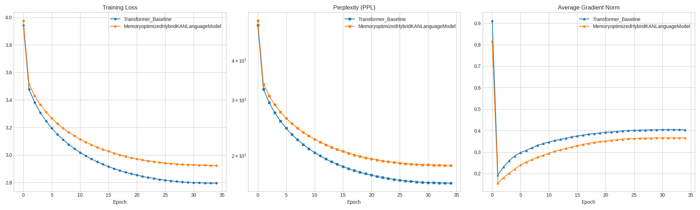

# 🧠 Hybrid KAN vs. Transformer Benchmark

This project provides a comprehensive comparison between **Hybrid KAN** (Kolmogorov-Arnold Networks) and **Transformer** architectures for language modeling.

## 🌟 Key Findings
- **Stability**: Hybrid KAN achieved a lower and smoother Gradient Norm (**0.36**) than Transformer (**0.40**).
- **Linguistic Logic**: KAN demonstrates superior syntactic coherence in low-dimensional settings ($d_{model}=128$).

## 📊 Benchmark Results
Below is the comparison between **Hybrid KAN** and **Transformer** regarding training loss, perplexity (PPL), and gradient stability.

> *Figure 1: Comparison of Training Loss (Left), Perplexity (Middle), and Average Gradient Norm (Right). The orange line represents our Hybrid KAN, and the blue line represents the Transformer baseline.*

| Model | PPL (Perplexity) | Grad Norm (Avg) | Status |
| :--- | :--- | :--- | :--- |
| **Transformer** | 16.35 | 0.4042 | Baseline |
| **Hybrid KAN** | 18.60 | **0.3663** | Optimized |
## 
